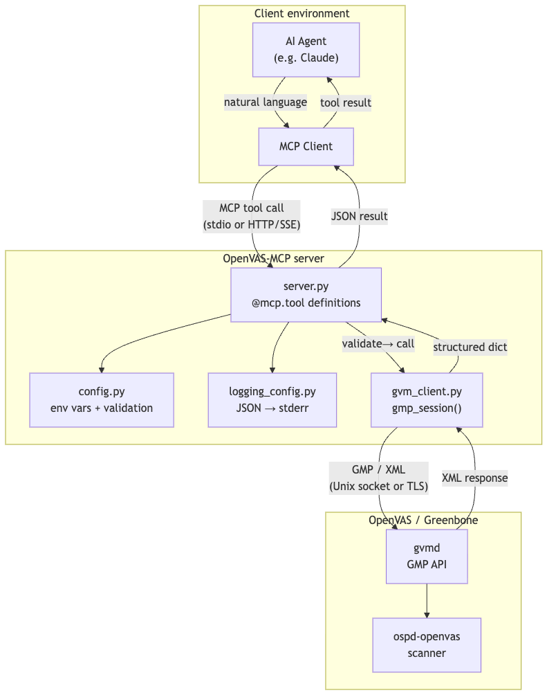

# Architecture

<!-- Architecture diagram: see architecture.mmd (Mermaid source) -->


## Overview

```
AI agent → MCP client → OpenVAS MCP server → GMP API → OpenVAS / Greenbone
```

The MCP server is a stateless protocol bridge. It receives tool calls from an AI agent, translates them into GMP (Greenbone Management Protocol) operations, and returns structured JSON results. It holds no state between calls beyond the GVM connection parameters.

## Module structure

```
openvas_mcp/
  __main__.py       # entry point — validates config, loads policy, starts server
  config.py         # all configuration loaded from environment variables
  logging_config.py # structured JSON logging to stderr
  auth.py           # API key store, client identity context var, ASGI auth middleware
  policy.py         # authorization policy engine (tool allow/deny, CIDR checks, scan limits)
  server.py         # MCP tool definitions (@mcp.tool decorators)
  gvm_client.py     # GVM connection factory + gmp_session() context manager
```

## Request flow

### stdio transport

1. AI agent calls an MCP tool (e.g. `start_scan`)
2. `server.py` checks that the tool is allowed by the policy (always permitted for stdio — identity is `None`, default policy is permissive)
3. Input is validated at the tool boundary (UUID format, string length, value ranges)
4. `gmp_session()` opens a connection to GVM and authenticates with the service account
5. The GMP method is called; the response is an XML `ElementTree`
6. The tool parses the XML into a plain Python dict and returns it
7. `gmp_session()` closes the connection on exit

### HTTP/SSE transport

1. HTTP request arrives at the ASGI stack
2. `AuthMiddleware` extracts the `Authorization: Bearer <token>` header, validates it against `APIKeyStore`, and stores the resulting `ClientIdentity` in a `contextvars.ContextVar` for the duration of the request
3. Unauthenticated or unrecognised tokens receive a `401` response immediately; `/health` is exempt
4. The MCP protocol handler decodes the JSON-RPC request and dispatches to the tool handler
5. The tool handler calls `get_current_client()` to retrieve the identity, then `get_policy().is_tool_allowed()` to enforce the policy; denied calls return `{"error": true, "code": "forbidden", ...}`
6. Remaining steps are the same as the stdio flow (input validation → GMP call → XML parse → return)

On any error (connection failure, GMP error, validation failure, policy violation), the tool returns a structured error dict — `{"error": true, "code": "...", "message": "..."}` — rather than raising an exception into the MCP framework.

## Transport modes

| Transport | Activated by | Auth | Use case |
|---|---|---|---|
| `stdio` | `MCP_TRANSPORT=stdio` (default) | None (trusted local process) | Claude Desktop, local agents |
| `sse` | `MCP_TRANSPORT=sse` | Bearer API key (optional) | Remote agents, compose deployments |
| `streamable-http` | `MCP_TRANSPORT=streamable-http` | Bearer API key (optional) | Remote agents, compose deployments |

## Connection modes (GVM)

| Mode | When | Config |
|---|---|---|
| Unix socket | Default | `GVM_SOCKET_PATH` (default `/run/gvmd/gvmd.sock`) |
| Plain TCP | `GVM_HOST` set, `GVM_TLS` not set | `GVM_HOST`, `GVM_PORT` — IPv4 and IPv6 supported |
| TLS | `GVM_HOST` + `GVM_TLS=1` | `GVM_HOST`, `GVM_PORT`, optional `GVM_TLS_CAFILE` for self-signed certs — IPv4 and IPv6 supported |

## Authentication and authorization model

### Identity

`AuthMiddleware` is a pure ASGI middleware (not `BaseHTTPMiddleware`) wrapping the FastMCP Starlette app for HTTP transports. It validates the Bearer token against the `APIKeyStore` loaded from `MCP_API_KEYS` and stores the `ClientIdentity` in a `contextvars.ContextVar`. This makes the identity available to all tool handlers without threading through function parameters.

If `MCP_API_KEYS` is not set, the middleware is not installed and all HTTP requests are accepted — intended for development only. Set `MCP_ALLOW_UNAUTHENTICATED=1` to acknowledge this explicitly; omitting it when no keys are configured causes startup to fail.

> **Note:** When `MCP_ALLOW_UNAUTHENTICATED=1` is set alongside a `MCP_POLICY_FILE`, a startup warning is emitted. All requests arrive with no client identity and are evaluated against the `default` policy block; named `clients:` entries are never matched.

### Policy enforcement

A `Policy` object is loaded from `MCP_POLICY_FILE` at startup and installed as a module-level singleton via `set_policy()`. Tool handlers call `get_policy()` to enforce:

- **Tool-level allow/deny** — each client has an `allowed_tools` list (`["*"]` for all)
- **CIDR target restriction** — `create_target` validates every host/CIDR in the request against the client's `allowed_cidrs`; non-CIDR entries are treated as fnmatch hostname patterns (e.g. `*.internal`, `db.prod`)
- **Concurrent scan limit** — `start_scan` counts active tasks before creating a new one when `max_concurrent_scans > 0`; this count is GVM-global, not per-client — scans started outside of MCP (e.g. via the GVM UI) consume the same capacity

Clients not listed in the policy fall back to the `default` block. If `MCP_POLICY_FILE` is unset, the default policy permits everything. If it is set but the file is missing, startup fails with an error.

## Release integrity

Every image published to `ghcr.io/cybersecauto-labs/openvas-mcp` goes through the following before it reaches users:

1. **Lint, type checking, and unit tests** pass on Python 3.10, 3.11, and 3.12 (`ci.yml`)
2. **Integration tests** against a live Greenbone Community Edition stack verify real GMP operations (`integration.yml`) — gated on PRs targeting `main`
3. **Telemetry audit** runs the server in a `--network=none` Docker container, asserting no unexpected outbound connections at startup or idle (`docker.yml`)
4. **Image signed** with cosign keyless OIDC signing — the signature is stored in GHCR alongside the image and can be verified without trusting a managed key (`release.yml`)
5. **CycloneDX SBOM** generated by `syft` from the published image digest and attached to the GitHub Release

To verify a release image:

```bash
cosign verify \
  --certificate-identity-regexp "https://github.com/CyberSecAuto-Labs/OpenVAS-MCP/.github/workflows/release.yml@refs/tags/.*" \
  --certificate-oidc-issuer "https://token.actions.githubusercontent.com" \
  ghcr.io/cybersecauto-labs/openvas-mcp:<version>
```

## Logging and audit

All output goes to stderr. The stdio transport uses stdout as the JSON-RPC channel; any byte written there corrupts the stream. Logs are emitted as structured JSON, one object per line, configurable via `LOG_LEVEL`.

Every tool invocation and completion is logged with `client_id`, providing an audit trail linking each operation to an authenticated client:

```json
{"ts": "2026-03-31T10:00:00Z", "level": "INFO", "logger": "openvas_mcp.server", "msg": "tool invoked", "tool": "start_scan", "params": {"name": "...", "target_id": "..."}, "client_id": "scanner-bot"}
{"ts": "2026-03-31T10:00:01Z", "level": "INFO", "logger": "openvas_mcp.server", "msg": "tool completed", "tool": "start_scan", "status": "ok", "client_id": "scanner-bot"}
```

Auth events (unauthenticated requests, invalid keys, policy denials) are logged at `WARNING` level.
